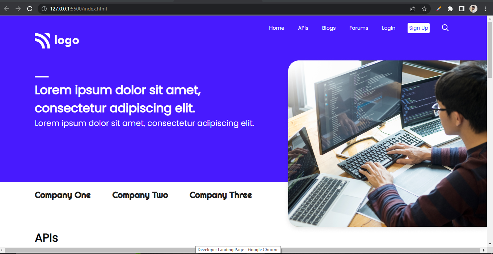

# Assignment 9

## Project 9 [Live Link](https://nachiketkeripaleproject9.netlify.app/)

-  
-  As this was full page with multiple sections so i have used flex and position in this project.
-  Used Goolge Fonts for this project.

---

## Time taken to finish this project

-   7 hour to complete it.

#### Screenshot

 

